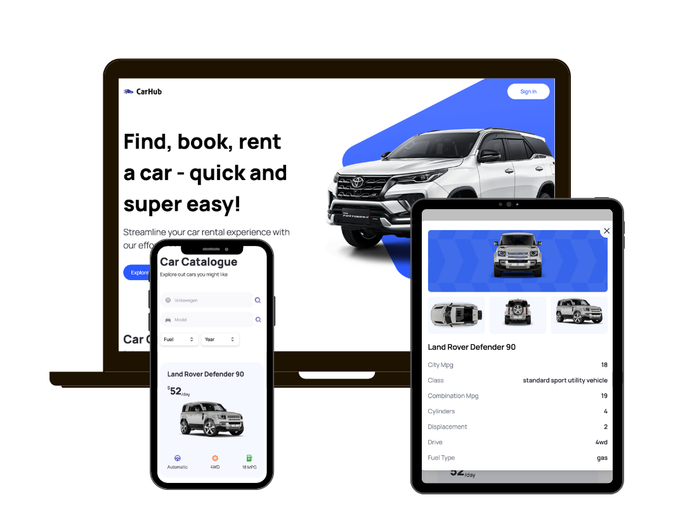

# CarHub - NextJS 13 (App Router) | React | TypeScript | TailwindCSS

This is a Car Information App that provides details about cars using the Cars API by API-Ninjas of RapidAPI. It incorporates headlessUI for seamless user interface components and imagin.studio for high-quality car images.

Live site URL: [https://car-hub-showcase-8bic-kennylun123.vercel.app/](https://car-hub-showcase-8bic-kennylun123.vercel.app/)

## What I learned

- Static Typing of TypeScript, enable to define variable types and catch type-related errors during development.
- TailwindCSS, utility first approach and we can also define reuseable general style class as a custom bundle utility.
- (NextJS 13) Dynamic content delivery on server side rendering by utilizing searchParams

## Libraries and APIs

- [Cars by API-Ninjas, RapidAPI](https://rapidapi.com/apininjas/api/cars-by-api-ninjas/)
- [headlessUI](https://headlessui.com/)
  - Combobox
  - Transition
  - Dialog(modal)
  - Listbox(select / options)
- [Imagin Studio (Car image api)](https://www.imagin.studio/solutions/api)

## Acknowledgments

Thanks to [JavaScript Mastery](https://www.jsmastery.pro/) for this amazing design inspiring me to use NextJS, TypeScript and Tailwind together for the first time.
